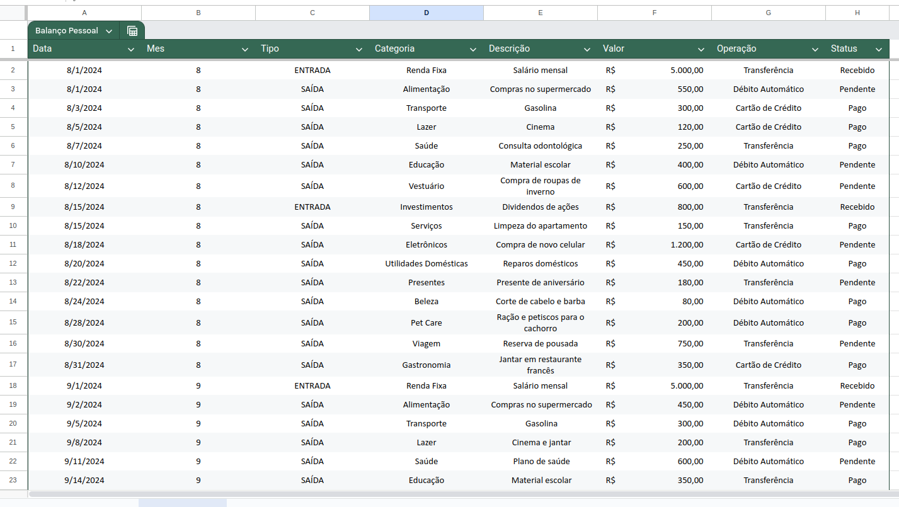
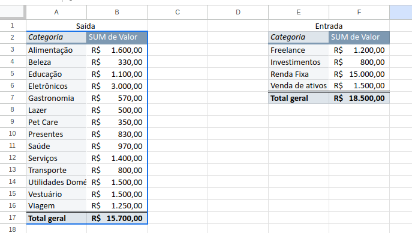
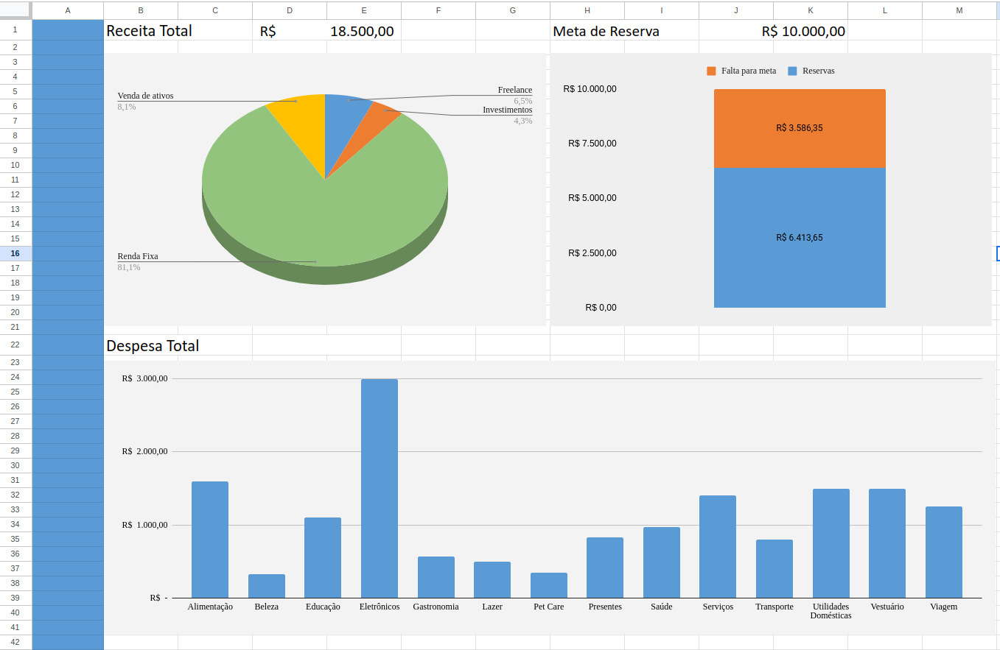

<h1>
<a href="https://www.dio.me/">
     </a>
    <span> CAIXA - IA Generativa com Microsoft Copilot</span>
</h1>

# :computer: Desafio de projeto: Como organizar sua vida Financeira com Planilhas Inteligentes e IA

O objetivo desse projeto é analisar dados de despesas e receitas de uma planílha. 

[Dados fornecidos pelo instrutor](https://hermes.dio.me/files/assets/f631a203-25c9-46c0-8ce9-ce6933cc87b3.xlsx)


# :bulb: Solução do desafio

Utilizei o Google Planilhas para realizar a análise dos dados. O arquivo completo encontra-se em `dados/CAIXA_IA_Planilha.xlsx`.

Apõs carregar os dados brutos gerei uma tabela e adicione a coluna mês.



Exportei os dados da tabela para o arquivo `dados/CAIXA_IA_Tabela.xlsx`.

Gerei as tabelas dinâmicas para gastos e receita (Veja o arquivo da planilha)



Gerei dados aleatórios para depósitos de reserva usando o google gemini.

Finalmente plotei os gráficos:




## AI insights

Exportando somente a tabela de dados podemos adicioná-la ao chatgpt e fazer pergunta sobre os dados.

## Prompt:
```
Considere a tabela acima como entrada de dados. O tipo SAÍDA representa gasto. Quais categorias se gastou mais?
```
As categorias com os maiores gastos são:

1. **Eletrônicos**: R$ 3.000  
2. **Alimentação**: R$ 1.600  
3. **Utilidades Domésticas**: R$ 1.500  
4. **Vestuário**: R$ 1.500  
5. **Serviços**: R$ 1.400  

Caso precise de mais detalhes ou gráficos, posso ajudar!

## Prompt:
```
Como economizar nos gastos sendo que não é possível diminuir o valor das categorias alimentação e serviços e saúde? Considere os gastos mais supérfluos como mais relevantes para economizar.
```
Para economizar considerando que **Alimentação**, **Serviços** e **Saúde** são indispensáveis e que gastos supérfluos têm prioridade para corte, podemos focar nas categorias com maior potencial de ajuste. Com base nos dados, aqui está uma análise prática:  

### Categorias Supérfluas para Economia:
1. **Eletrônicos (R$ 3.000)**  
- **Análise**: Essa é a maior categoria de gastos. Avalie a necessidade de cada compra.  
- **Estratégia**:  
- Evitar compras impulsivas de tecnologia.  
- Optar por reparos em vez de substituições de equipamentos.  
- Adiar upgrades de aparelhos não essenciais.  

2. **Vestuário (R$ 1.500)**  
- **Análise**: Compras de roupas podem ser reduzidas sem grande impacto.  
- **Estratégia**:  
- Planejar compras em promoções ou outlets.  
- Focar em peças versáteis e duradouras.  
- Reduzir compras por tendência de moda.  

3. **Viagem (R$ 1.250)**  
- **Análise**: Despesas com viagens podem ser ajustadas com planejamento.  
- **Estratégia**:  
- Optar por destinos mais econômicos ou viagens fora de temporada.  
- Usar pontos ou milhas acumulados para reduzir custos.  
- Reavaliar a frequência de viagens.  

4. **Lazer (R$ 500)** e **Gastronomia (R$ 570)**  
- **Análise**: Esses gastos são relevantes, mas geralmente têm margem para ajuste.  
- **Estratégia**:  
- Substituir atividades pagas por opções gratuitas ou de baixo custo (como parques ou eventos culturais).  
- Cozinhar mais em casa em vez de comer fora frequentemente.  

5. **Presentes (R$ 830)**  
- **Análise**: Os presentes podem ser mais simbólicos e econômicos.  
- **Estratégia**:  
- Criar presentes personalizados ou artesanais.  
- Planejar compras com antecedência para aproveitar descontos.  

6. **Beleza (R$ 330)** e **Pet Care (R$ 350)**  
- **Análise**: Pequenos cortes nessas categorias podem acumular economias.  
- **Estratégia**:  
- Reduzir a frequência de tratamentos de beleza ou optar por serviços mais acessíveis.  
- Comprar produtos de cuidados para pets em maior quantidade ou em promoções.  

### Exemplo de Economia:
Se você reduzir 50% dos gastos em **Eletrônicos**, **Vestuário**, e **Viagem**, já terá economizado R$ 2.875. Com ajustes menores nas outras categorias, a economia pode aumentar ainda mais.  

Caso deseje, posso criar um plano detalhado para monitorar essas economias!